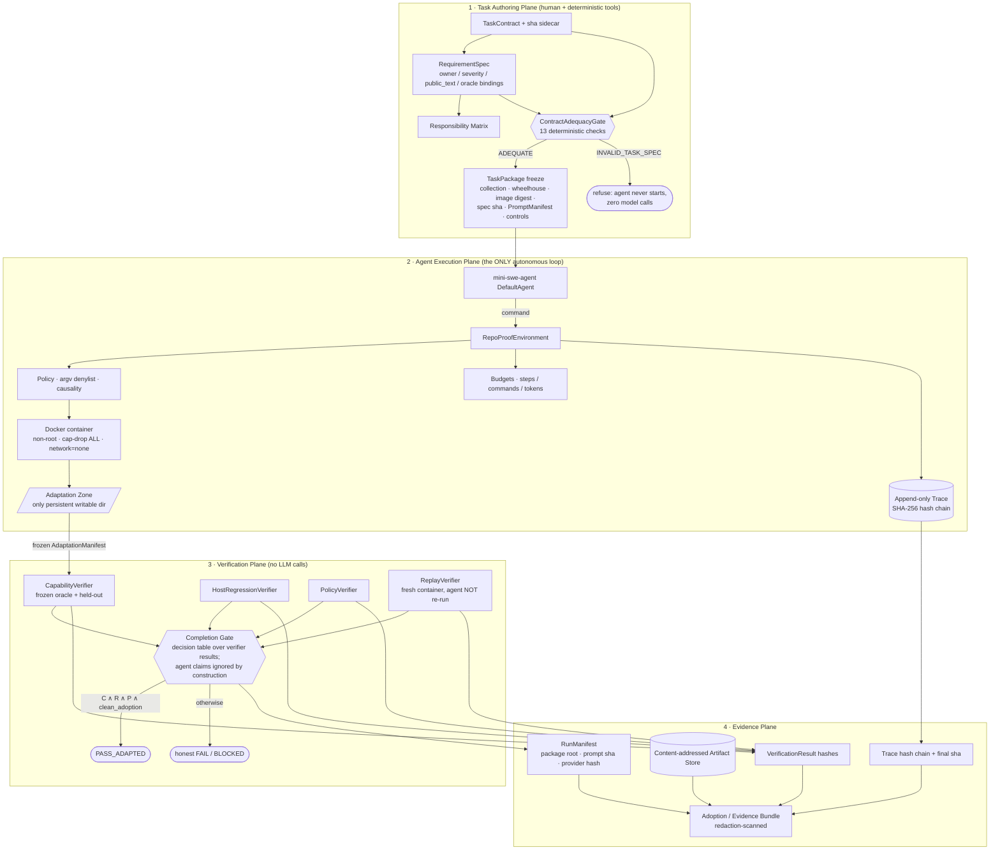

# Architecture — four planes, one agent loop

## Plane invariants (all pinned by tests)

1. **Task Authoring Plane** — everything normative is structured and
   hash-frozen; YAML comments cannot carry rules (adequacy check);
   the runner only VERIFIES frozen packages, never regenerates them.
2. **Agent Execution Plane** — contains the **single autonomous agent
   loop** in the whole system (`DefaultAgent.run`, called once per
   run; a static guard test forbids a second loop). Every command
   passes policy + budget and lands in the tamper-evident trace.
3. **Verification Plane** — pure programs; **no LLM anywhere**. The
   Completion Gate never reads agent claims. Replay re-executes the
   frozen adaptation in a fresh container — it does **not** re-run
   the agent.
4. **Evidence Plane** — every public number traces to a committed,
   redaction-scanned bundle; `verify-bundle` re-derives gate verdicts
   from hashes.

## Trust-zone summary

| Zone | Mount | Writable | Agent-visible |
|---|---|---|---|
| upstream (pinned commit) | `/upstream` | no | yes |
| consumer + guard + public tests | `/consumer` | no | yes |
| adaptation | `/adaptation` | **yes** | yes |
| oracle + held-out fixtures | verification containers only | no | **no** |
| scratch | `/tmp` | yes (ephemeral) | yes |
